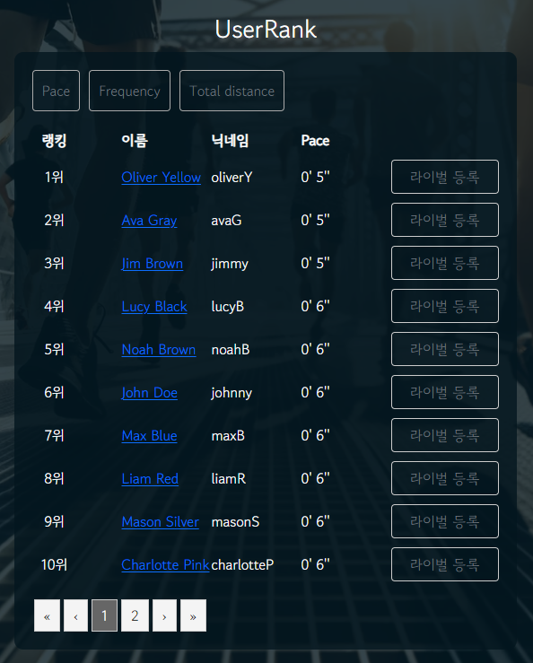
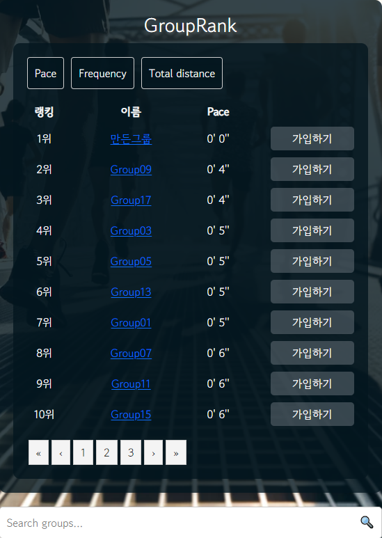
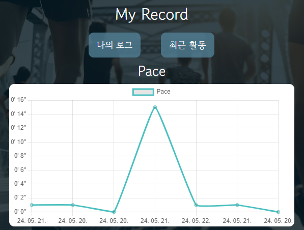
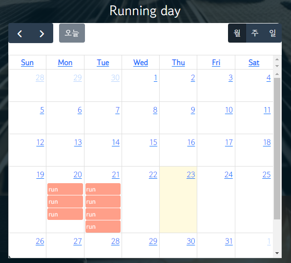
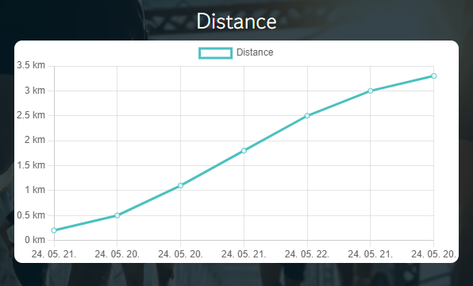
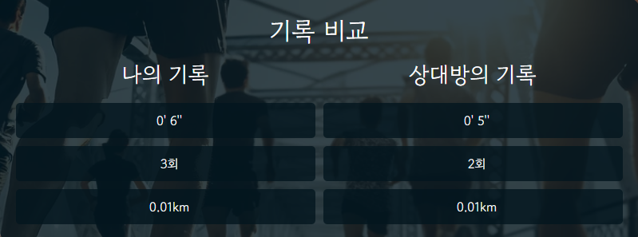

# project
ssafy 상 last pjt

    <h1>프로젝트 기술서</h1>

    <h2>목차</h2>
    <ul>
        <li>1. 팀원 소개</li>
        <li>2. 개발 목표</li>
        <li>3. 개발 일정</li>
        <li>4. 설계</li>
        <li>5. 구현 내용</li>
    </ul>

    <h2>1. 팀원 소개</h2>
    <ul>
        <li><strong>배수아</strong>
            <ul>
                <li>역할: 프론트엔드 개발자</li>
                <li>Bootstrap 및 Strava 연동</li>
                <li>전반적인 View Component 및 함수 제작</li>
            </ul>
        </li>
        <li><strong>유석민 (팀장)</strong>
            <ul>
                <li>역할: 백엔드 개발자</li>
                <li>MySQL 데이터베이스 관리</li>
            </ul>
        </li>
    </ul>

    <h2>2. 개발 이유 – 타 러닝 서비스의 아쉬움</h2>
    <ul>
        <li>친구를 등록하기 위해서는 연락처를 알아야 한다.</li>
        <li>다른 사용자의 기록을 살펴보는 게 직관적이지 않다.</li>
        <li>나의 기록을 살펴보는 게 직관적이지 않다.</li>
    </ul>

    <h2>3. 개발 목표</h2>
    <ul>
        <li><strong>개인 운동 기록</strong>: 나이키 런 클럽과 마찬가지로 나의 런닝을 측정하고 기록할 수 있다.</li>
        <li><strong>라이벌과 경쟁</strong>: 등록된 친구가 아니더라도 정보 공개를 허용한 사용자의 기록을 통해 나의 실력을 가늠하거나 동기부여가 될 수 있다.</li>
        <li><strong>그룹</strong>: 실력, 목표 등이 비슷한 다른 사용자나 지인들과 그룹을 형성해 커뮤니케이션을 할 수 있다.</li>
    </ul>

    <h2>4. 개발 일정</h2>
    <ul>
        <li>사진명을 적으시오.</li>
    </ul>

    <h2>5. 설계 및 기술 스택</h2>
    <ul>
        <li>사진명을 적으시오.</li>
    </ul>

    <h2>6. 구현 내용</h2>
    <ul>
        <li><strong>Strava API를 이용한 런닝 기록</strong>
            <ul>
                <li>Strava API로 런닝 기록을 서비스와 연동</li>
            </ul>
        </li>
        <li><strong>MyRecordView - 나의 로그</strong>
            <ul>
                <li>나의 페이스 기록을 그래프로 표시해주는 기능</li>
                <li>내가 달린 누적 거리를 계산해 출력해주는 기능</li>
                <li>달력에 내가 달린 날을 표시해주는 기능 (일, 주, 월별로 볼 수 있음)</li>
            </ul>
        </li>
        <li><strong>MyRecordView - 최근 활동</strong>
            <ul>
                <li>나의 페이스 기록을 그래프로 표시해주는 기능</li>
                <li>최근 런닝 기록을 날짜, 거리, 시간, 페이스 순으로 출력</li>
            </ul>
        </li>
        <li><strong>UserRankView - 사용자 랭킹 및 검색</strong>
            <ul>
                <li>사용자들을 페이스 기록 순으로 정렬 (일, 주, 월별로 볼 수 있음)</li>
                <li>사용자들을 빈도 순으로 정렬</li>
                <li>사용자들을 총 거리 기록 순으로 정렬</li>
            </ul>
        </li>
        <li><strong>라이벌 기능</strong>
            <ul>
                <li>나의 페이스 기록을 그래프로 표시해주는 기능</li>
            </ul>
        </li>
        <li><strong>GroupRankView – 그룹 랭킹 및 검색</strong>
            <ul>
                <li>그룹을 페이스 기록 순으로 정렬 (일, 주, 월별로 볼 수 있음)</li>
                <li>그룹을 빈도 순으로 정렬</li>
                <li>그룹을 총 거리 기록 순으로 정렬</li>
            </ul>
        </li>
        <li><strong>그룹 상세 페이지</strong>
            <ul>
                <li>그룹에 속한 사용자들을 랭킹 순서대로 출력</li>
                <li>그룹 멤버들끼리 다양한 정보를 주고받을 수 있는 게시판 기능</li>
            </ul>
        </li>
        <li><strong>게시판</strong>
            <ul>
                <li>게시글 목록</li>
                <li>게시글 작성</li>
                <li>게시글 수정</li>
                <li>게시글 상세</li>
            </ul>
        </li>
        <li><strong>HomeView Nav Bar Hamburger Button</strong>
            <ul>
                <li>이동할 페이지로 메뉴를 보여주는 HamburgerButton</li>
                <li>메인 화면으로 이동할 수 있는 버튼인 Running Mate</li>
                <li>로그인 & 로그아웃 버튼과 그룹 생성</li>
                <li>Strava에서 데이터를 가져오는 기능을 가진 Nav Bar</li>
            </ul>
        </li>
        <li><strong>회원가입 및 로그인</strong>
            <ul>
                <li>로그인 기능</li>
                <li>회원가입 기능</li>
            </ul>
        </li>
    </ul>

    <h2>7. 미구현 기능</h2>
    <ul>
        <li>이미지 업로드</li>
        <li>SNS 로그인 기능</li>
        <li>그룹 관리자</li>
    </ul>

    
감사합니다. 😊

# 프로젝트 이름 : Running Mate

# 팀원 소개

  <table>
    <tr>
      <td align="center">
        <a href="https://github.com/SACANDO">
          
           
          <strong>배수아</strong>
        </a>
      </td>
      <td>
        <ul>
          <li>팀장</li>
          <li>백엔드 파트</li>
          <li>프론트엔드 bootstrap적용 및 strava api연결</li>
          <li>MySql</li>
        </ul>
      </td>
    </tr>
    <tr>
      <td align="center">
        <a href="https://github.com/roqdkfwk">
          
           
          <strong>유석민</strong>
        </a>
      </td>
      <td>
        <ul>
          <li>팀원</li>
          <li>프론트엔드 파트</li>
          <li>Documentation</li>
        </ul>
      </td>
    </tr>
  </table>

# 프로젝트 소개
<ul>
<li>앱 소개 : 서드파티 런닝앱(스트라바)으로 기록한 런닝 데이터를 api로 받아와, 다른 유저와 경쟁 및 비교하는 랭킹 시스템</li>
<li>앱 목표 : 본인의 런닝 실력을 가늠하고 런닝에 동기를 부여한다.</li>
</ul>

<h1>📚 STACKS</h1>

 
  
  
  
   
  
  
  
   
  
   
  
  
  
   
  
  

# 기본 기능

## 메인 

 
메인 화면에서는 사용자가 로그인을 할 수 있으며, 기본 기능들에 접근할 수 있는 Nav Bar와 주요 기능들에 접근할 수 있는 HanBurger Button이 있습니다.

# 핵심 기능

## 유저 랭킹

 
사용자 랭킹 화면에서는 Pace, Frequenct, Total Distance에 따라 사용자들의 랭킹이 정렬되어 보입니다.
또한 특정 사용자와의 기록 비교, 라이벌 등록 등의 기능이 있고 검색을 통해 원하는 사용자를 찾을 수도 있습니다.

## 그룹 랭킹

 
그룹 랭킹 화면에서는 Pace, Frequenct, Total Distance에 따라 그룹들의 랭킹이 정렬되어 보입니다.
또한 그룹 상세 페이지로 이동, 그룹에 가입하기 등의 기능이 있고 검색을 통해 원하는 그룹을 찾을 수도 있습니다.

## 나의 기록

 
나의 기록 화면에서는 나의 Pace, Distance를 그래프로 확인하거나 달린 날을 달력에서 확인할 수 있습니다.

## 라이벌과 비교

 
다른 사용자와의 비교 화면에서는 나와 다른 사용자의 기록을 비교할 수 있습니다.
